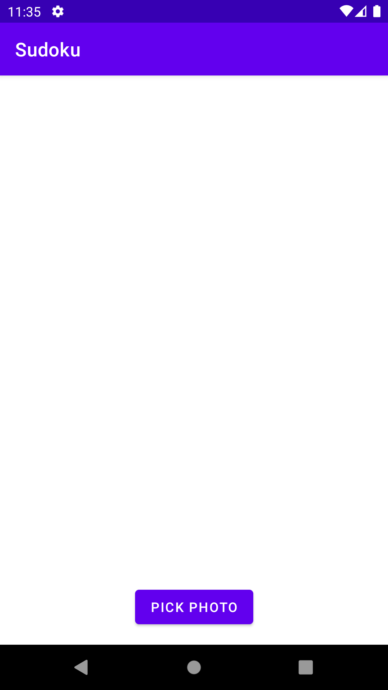
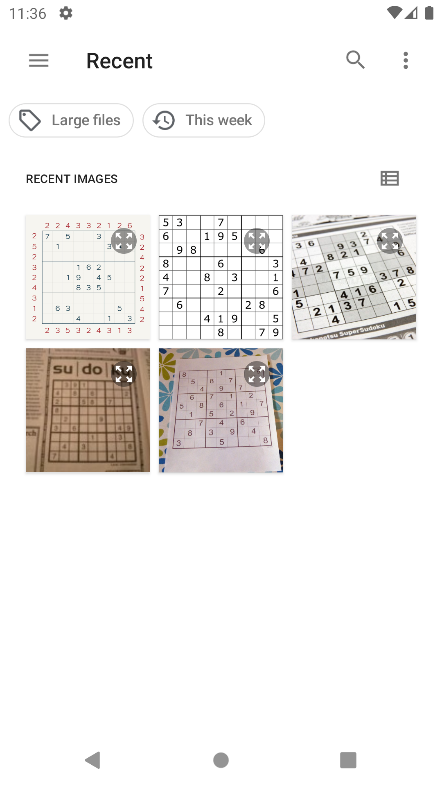
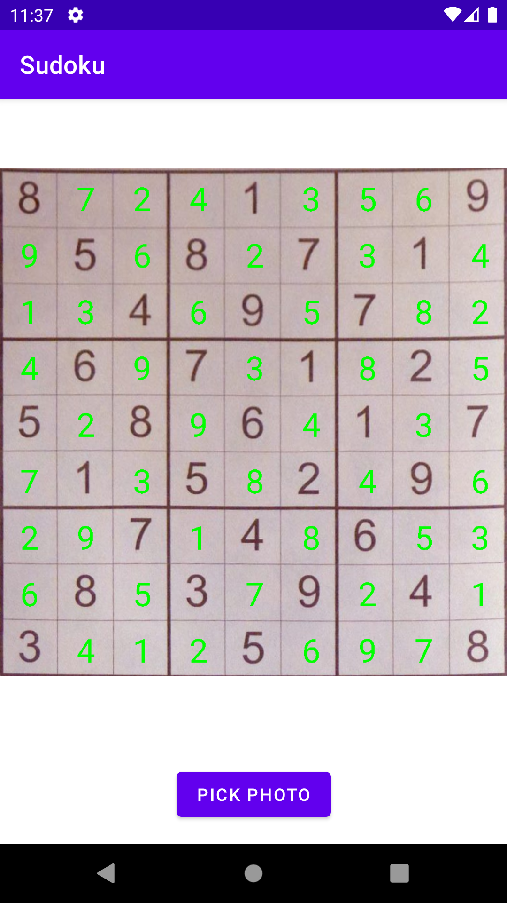

# OpenCV and ML Kit powered Android sudoku solver

<table>
    <tr>
        <td></td>
        <td></td>
        <td></td>
    </tr>
</table>

## Technology used
- Board detection & extraction: OpenCV
- Text recognition: Google ML Kit
- Sudoku solver: Brute force

## Setup

### OpenCV setup
1. Download [OpenCV 4.6.0 for Android](https://sourceforge.net/projects/opencvlibrary/files/4.6.0/opencv-4.6.0-android-sdk.zip/download).
2. Import OpenCV as a module named "opencv".
3. Open "opencv/build.gradle", and set `compileSdkVersion` and `targetSdkVersion` as 33.

```
android {
    compileSdkVersion 33

    defaultConfig {
        minSdkVersion 21
        targetSdkVersion 33
        ...
    }
}
```

### ML Kit setup
1. Set up a Firebase project.
2. Download "google-services.json" into the "app" folder.

## How it works

### Board detection and extraction

<table>
    <tr>
        <td width="25%">Original image</td>
        <td width="25%">Grayscale image</td>
        <td width="25%">Largest contour</td>
        <td width="25%">Perspected image</td>
    </tr>
    <tr>
        <td></td>
        <td></td>
        <td></td>
        <td></td>
    </tr>
</table>

*Original image from [Sudoku Solver using Computer Vision and Deep Learning — Part 1](https://aakashjhawar.medium.com/sudoku-solver-using-opencv-and-dl-part-1-490f08701179).*

### Text recognition
TBC

### Sudoku solver
TBC