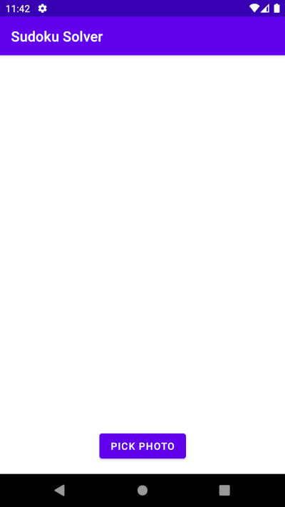
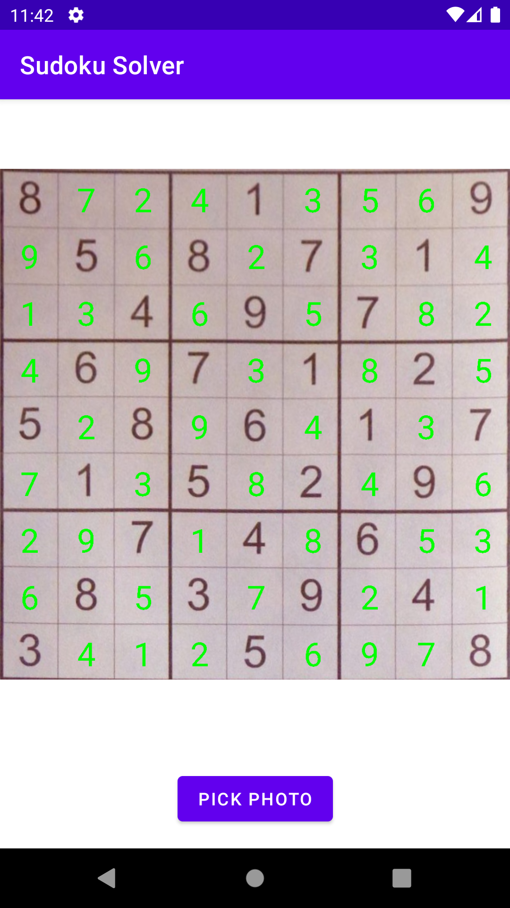
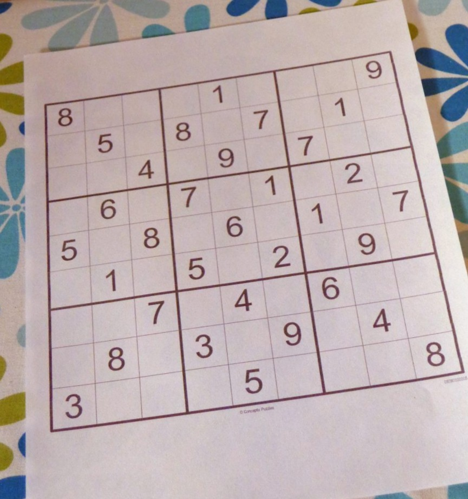
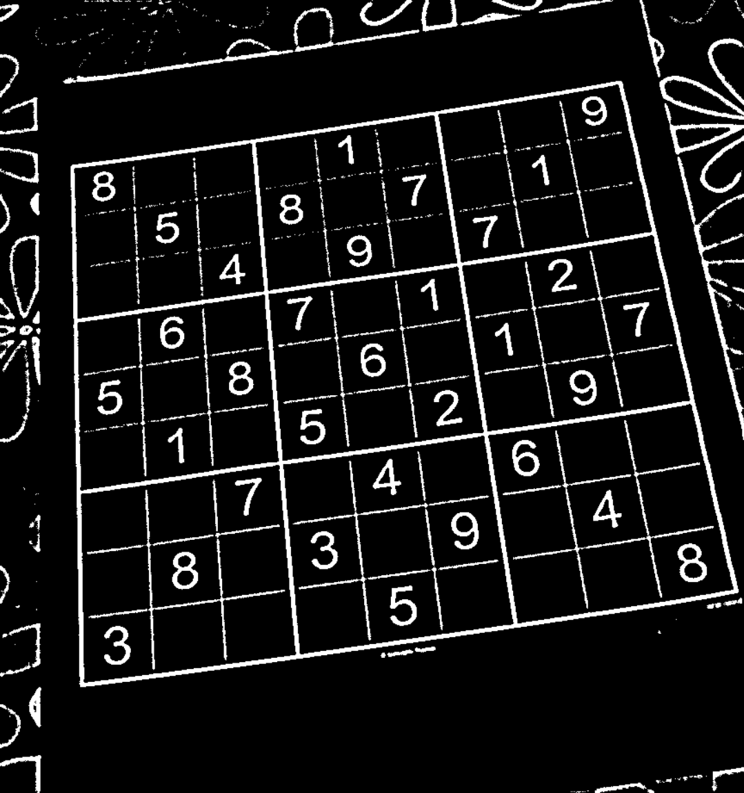
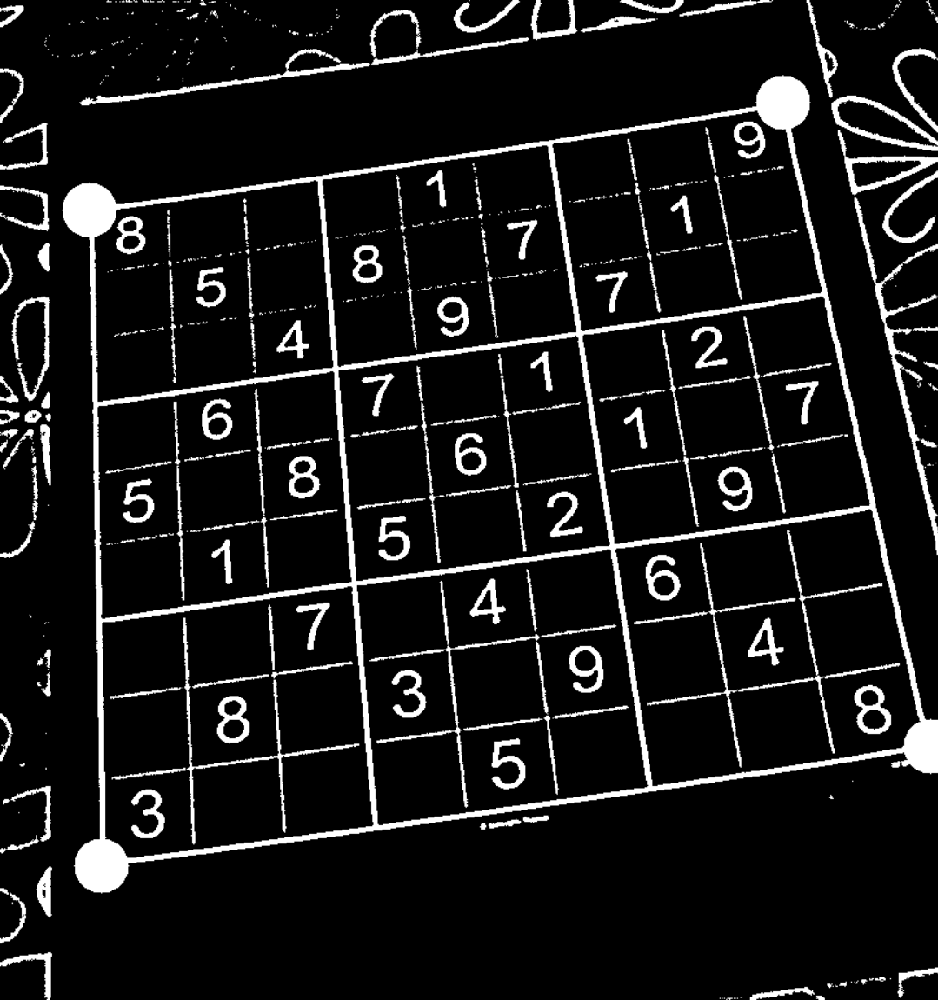
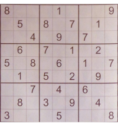
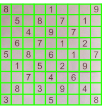

<h1 align="center">
    OpenCV and ML Kit powered<br />Android sudoku solver
    <br />
    <a href="https://github.com/cemtuver/android-sudokusolver/releases">
        
    </a>
</h1>

Want to try it out?
<br />
The latest APK file is available on the [releases page](https://github.com/cemtuver/android-sudokusolver/releases).

<table>
    <tr>
        <td></td>
        <td></td>
        <td></td>
    </tr>
</table>

## Technology used
- Board detection & extraction: OpenCV
- Text recognition: Google ML Kit
- Sudoku solver: Brute force

## How it works

### Board detection and extraction
The sudoku board is detected using OpenCV contour detection. To be able to find the contours, the image is converted into the grayscale mode. Then, after finding the largest contour and its corners, perspective transformation is applied to the original image to project the largest contour, the sudoku board, to the result.

<table>
    <tr>
        <td width="25%">Original image</td>
        <td width="25%">Grayscale image</td>
        <td width="25%">Largest contour</td>
        <td width="25%">Board image</td>
    </tr>
    <tr>
        <td></td>
        <td></td>
        <td></td>
        <td></td>
    </tr>
</table>

<i>Original image is from <a href="https://aakashjhawar.medium.com/sudoku-solver-using-opencv-and-dl-part-1-490f08701179" target="_blank">Sudoku Solver using Computer Vision and Deep Learning — Part 1</a></i>.


### Text recognition
The board image is divided into cell images, and each cell image is sent to the ML Kit text recognizer. After each cell is processed, the sudoku values array is constructed.

<table>
    <tr>
        <td width="25%">Board image</td>
        <td width="25%">Cell images</td>
        <td width="50%">Values array</td>
    </tr>
    <tr>
        <td></td>
        <td></td>
        <td>
            [<br />
            &nbsp;[8, 0, 0, 0, 1, 0, 0, 0, 9], <br />
            &nbsp;[0, 5, 0, 8, 0, 7, 0, 1, 0], <br />
            &nbsp;...<br />
            &nbsp;[3, 0, 0, 0, 5, 0, 0, 0, 8], <br />
            ]
        </td>
    </tr>
</table>

### Sudoku solver
The current sudoku solver algorithm tries every possible solution naively and recursively fills out the sudoku board. This approach is described under the "Naive approach" section in [here](https://www.geeksforgeeks.org/sudoku-backtracking-7).
Even though only one algorithm is implemented at the moment, the implementation is extendable, and some other algorithms will be added in the future.

### Limitations
- The app can only pick images from the device's gallery at the moment. The camera capture will be implemented in the future.
- The board detection logic is based on detecting the largest enclosed shape. If there exists a larger shape than the sudoku board, detection and extraction will result in incorrect images. There are more reliable methods, such as detecting the horizontal and vertical lines instead of the largest enclosed shape. However, currently, the app doesn't implement such methods.
- The board extraction doesn't respect the orientation of the image. If the sudoku board is rotated more than 45 degrees, the extracted image will also be rotated. 
- According to the [ML Kit text recognition documentations](https://developers.google.com/ml-kit/vision/text-recognition/android), each number should be at least 16x16 pixels. So to get the best performance out of text recognition, the image should be at least 360x360 pixels.

## Setup

### OpenCV setup
1. Download [OpenCV 4.6.0 for Android](https://sourceforge.net/projects/opencvlibrary/files/4.6.0/opencv-4.6.0-android-sdk.zip/download).
2. Import OpenCV as a module named "opencv".
3. Open "opencv/build.gradle", and set `compileSdkVersion` and `targetSdkVersion` as 33.

```
android {
    compileSdkVersion 33

    defaultConfig {
        minSdkVersion 21
        targetSdkVersion 33
        ...
    }
}
```

### ML Kit setup
1. Set up a Firebase project.
2. Download "google-services.json" into the "app" folder.